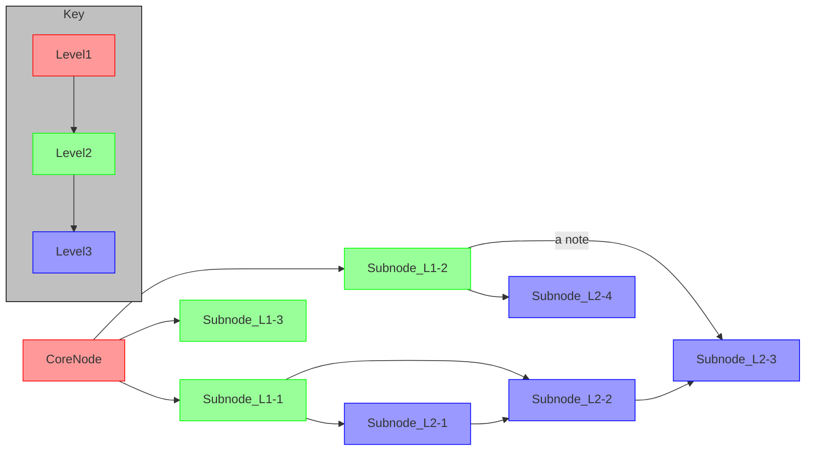

# L3Y1PSummerProject-CV
Project to make a dynamic online CV
Tis is some text but **this is in bold**

## This is heading level 2

# Test Mermaid Mindmap

```mermaid
graph LR;

style Key fill:#C0C0C0, stroke:#000000
subgraph Key
direction TB
style Level1 fill:#ff9999, stroke:#FF0000
Level1-->Level2; style Level2 fill:#99ff99, stroke:#00ff00
Level2-->Level3; style Level3 fill:#9999ff, stroke:#0000ff

end

style CoreNode fill:#ff9999, stroke:#FF0000

CoreNode-->Subnode_L1-1; style Subnode_L1-1 fill:#99ff99, stroke:#00ff00
CoreNode-->Subnode_L1-2; style Subnode_L1-2 fill:#99ff99, stroke:#00ff00
CoreNode-->Subnode_L1-3; style Subnode_L1-3 fill:#99ff99, stroke:#00ff00

Subnode_L1-1-->Subnode_L2-1; style Subnode_L2-1 fill:#9999ff, stroke:#0000ff
Subnode_L1-1-->Subnode_L2-2; style Subnode_L2-2 fill:#9999ff, stroke:#0000ff

Subnode_L1-2-- a note --->Subnode_L2-3; style Subnode_L2-3 fill:#9999ff, stroke:#0000ff
Subnode_L1-2-->Subnode_L2-4; style Subnode_L2-4 fill:#9999ff, stroke:#0000ff
Subnode_L2-1-->Subnode_L2-2
Subnode_L2-2-->Subnode_L2-3
```
