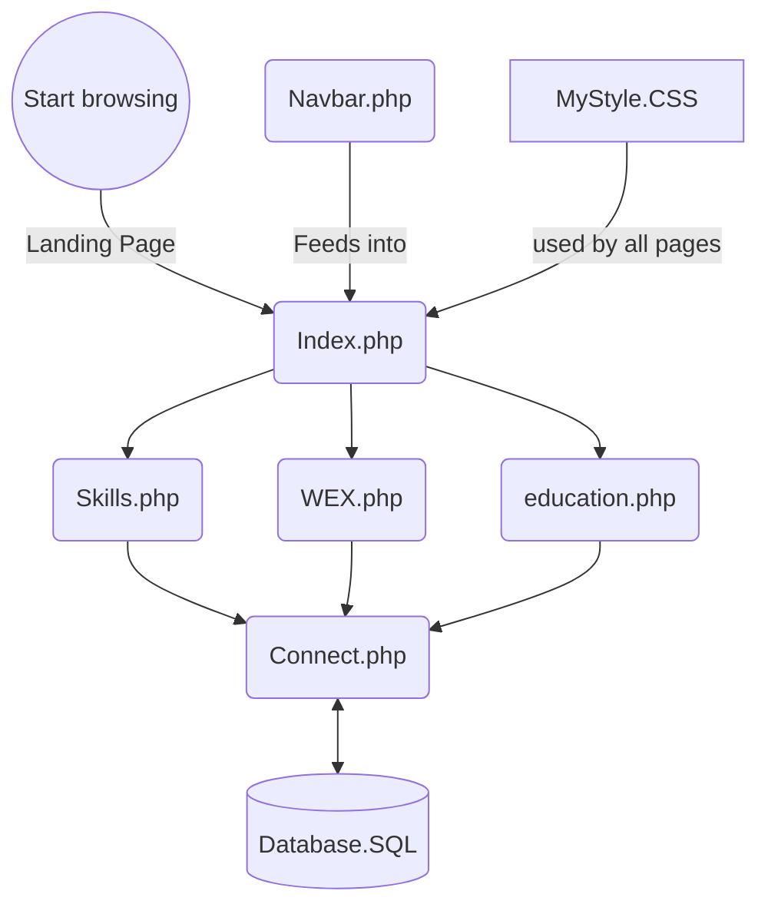

# Online CV Template
This Project provides the files to make a dynamic online CV

A CV is a document that often contains a series of tables of information (skills, education, employment history etc. which can be more efficiently created dynamically from a database table via than in a static html table. This contains the basic files to use as a basis for creating your own online CV/Portfolio.

# Planning

See [this document](https://github.com/NeilParkerBSDC/Online-CV-Template/commit/dea4541d0426367647c29a62c79c32c3bb1ed86c)

A CV will typically have sections on the following:
- Personal/contact details
- Personal Statement
- Skills
- Employment History
- Education
- Acheivements
- Projects
- Interests
- Etc.

It is proposed that a separate page be created for each of these. For the most part each page will have a corresponding table in the database, although it would be good to be able to apply some relational linking of table e.g. skills and projects, skills and qualifications etc.

# Files in this project

## Database

- [SQL file to build MySQL database](https://github.com/NeilParkerBSDC/Online-CV-Template/blob/master/Database.sql)

## WebPages
***N.B. If there is no hyperlink, the file hasn't been produced/uploaded yet)***
- [Index.php](https://github.com/NeilParkerBSDC/Online-CV-Template/blob/master/Index.php) - Personal/contact details & Personal Statement. This does not need to be dynamically generated from a database as the details do not change much, and when they do they only need changing in this one place
- [connect.php](https://github.com/NeilParkerBSDC/Online-CV-Template/blob/master/connect.php) A file with the connection details for the dabase (needs customising to your details). This is in a separate file because it my be referenced in several php files that want to connect to the dataabse, and having one central file means any changes only need to be made in that file.
- [navbar.php](https://github.com/NeilParkerBSDC/Online-CV-Template/blob/master/navbar.php) I have separated out the navigation into a spearate file, so that if it is ammended it only needs ammending on one place
- [education.php](https://github.com/NeilParkerBSDC/Online-CV-Template/blob/master/education.php) (dynamically produiced table showing education/qualifications
- [WEX.php](https://github.com/NeilParkerBSDC/Online-CV-Template/blob/master/WEX.php) - Work Experience (Employment history, but called here "*work experience*" because that is more approriate to a student just setting out on their career
- [Skills.php](https://github.com/NeilParkerBSDC/Online-CV-Template/blob/master/Skills.php) - Skills (A list of the skills/programming languages etc. you have)
- Online Portfolio (links to evidence of projects completed/github etc.)

## Styling

- [MyStyle.css](https://github.com/NeilParkerBSDC/Online-CV-Template/blob/master/MyStyle.css) - stylesheet

# Site map



# How to use this repository

You can either:

- Download the files and copy them into your XAMPP web server folder, or
- Fork the repository to create your own copy on GitHub.

If you are unsure how to fork a repository, see the GitHub guide:

https://docs.github.com/en/get-started/quickstart/fork-a-repo

---

## Prerequisites

Before starting, make sure you have:

- XAMPP installed
- Apache running in XAMPP
- MySQL running in XAMPP
- A web browser (Chrome, Edge, Firefox etc.)


## Step 1: Create the Database

1. Open the **XAMPP Control Panel**.
2. Start **Apache** and **MySQL**.
3. Click the **Admin** button next to MySQL (or browse to http://localhost/phpmyadmin).
4. Click the **SQL** tab.
5. Open the file **Database.sql** from this repository.
6. Copy and paste the contents into the SQL window.
7. Click **Go** to create the database and tables.

---

## Step 2: Create a Website Folder

Navigate to your XAMPP web server folder:

```text
C:\xampp\htdocs\


Create a new folder for your website, for example:

C:\xampp\htdocs\MyCV\

## Step 3: Copy the Project Files

Copy the following files into your new folder:

- Index.php
- MyStyle.css
- Skills.php
- WEX.php
- connect.php
- Education.php
- navbar.php

You should also copy any additional files provided in future updates of the project.

## Step 4: Configure the Database Connection

Open:

connect.php


Check that the database settings match your XAMPP installation.

For a default XAMPP installation they will usually be:
```php
$servername = "localhost";
$username = "root";
$password = "";
```


If your database name is different, update the $dbname variable accordingly.

## Step 5: View the Website

Open your web browser and navigate to:

http://localhost/MyCV/


Replace MyCV with the name of the folder you created in Step 2.

For example:

http://localhost/Online-CV-Template/


Your online CV website should now load.

Customising Your CV

Edit the content to create your own online CV and portfolio.

You may wish to customise:

- Personal details
- Personal statement
- Qualifications
- Skills
- Work experience
- Projects
- Achievements
- Portfolio links
- Interests

## Troubleshooting
### Page Not Found

Check that:

- Apache is running in XAMPP.
- Your project folder is inside: C:\xampp\htdocs\
- You have typed the correct URL in your browser.

### Database Connection Error

Check that:

- MySQL is running in XAMPP.
- The database was created successfully.
- The settings in connect.php are correct.
- Blank Page

A PHP error may have occurred. Check your code carefully and ask your tutor for help if required.

